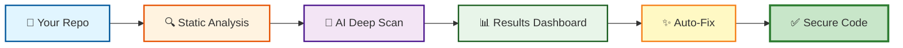
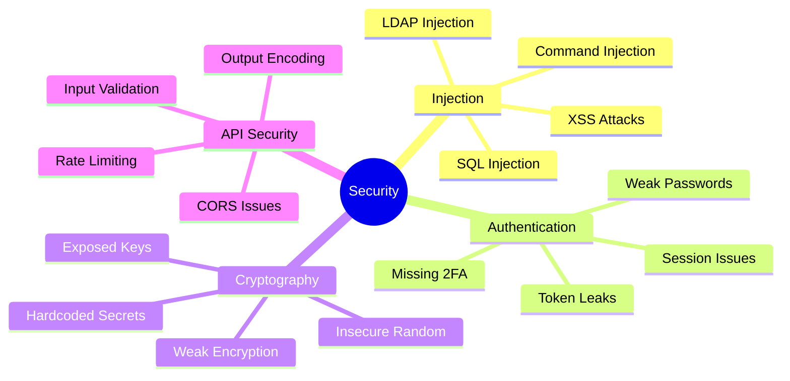
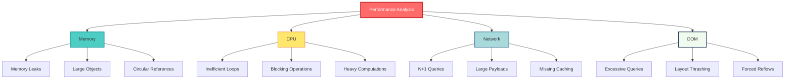
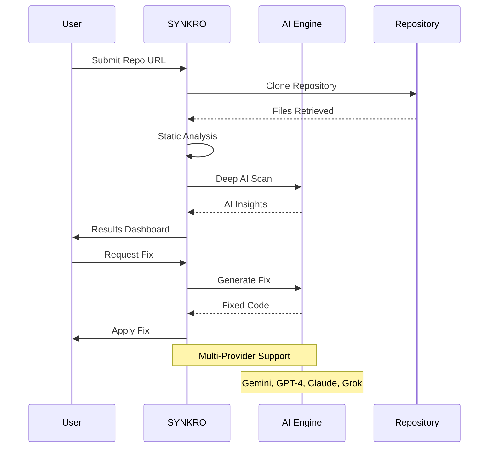
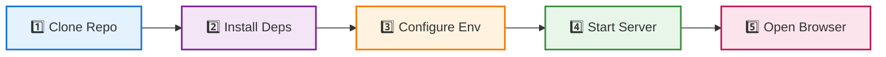
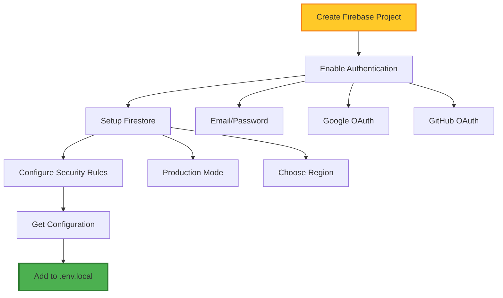
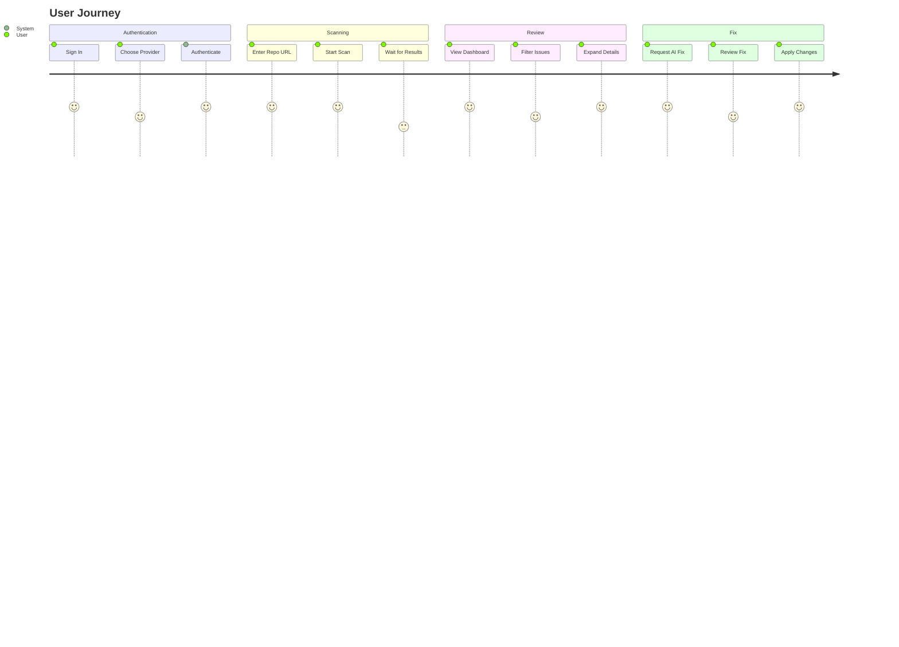
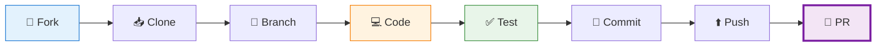

<div align="center">

# 🛡️ SYNKRO

### AI-Powered Code Security Scanner & Auto-Fixer

[](https://nextjs.org/)
[](https://reactjs.org/)
[](https://www.typescriptlang.org/)
[](LICENSE)

[](https://firebase.google.com/)
[](https://ai.google.dev/)
[](https://tailwindcss.com/)

**Ship code that's actually secure.**

[🚀 Quick Start](#-quick-start) • [📖 Documentation](#-table-of-contents) • [🎯 Features](#-features) • [🏗️ Architecture](#️-architecture) • [🤝 Contributing](#-contributing)


---

### 🎬 See It In Action


</div>

---

## 📊 Quick Stats

<div align="center">

| Metric | Value | Status |
|--------|-------|--------|
| 🔍 **Security Rules** | 100+ |  |
| 🤖 **AI Providers** | 5 |  |
| ⚡ **Avg Scan Time** | 30-60s |  |
| 📦 **Max Files/Scan** | 150 |  |
| 🌍 **Languages** | 20+ |  |
| 💰 **Pricing** | Free |  |

</div>

---

## 📋 Table of Contents

- [🎯 Overview](#-overview)
- [✨ Features](#-features)
- [🚀 Quick Start](#-quick-start)
- [📋 Prerequisites](#-prerequisites)
- [💿 Installation](#-installation)
- [⚙️ Configuration](#️-configuration)
- [📖 Usage](#-usage)
- [🏗️ Architecture](#️-architecture)
- [📁 Project Structure](#-project-structure)
- [🔌 API Reference](#-api-reference)
- [🤖 AI Providers](#-ai-providers)
- [🛠️ Development](#️-development)
- [🧪 Testing](#-testing)
- [🚀 Deployment](#-deployment)
- [🔧 Troubleshooting](#-troubleshooting)
- [🔒 Security](#-security)
- [⚡ Performance](#-performance)
- [🤝 Contributing](#-contributing)
- [📄 License](#-license)
- [💬 Support](#-support)

---

## 🎯 Overview

**SYNKRO** is an enterprise-grade, AI-powered code security scanner that analyzes GitHub repositories for vulnerabilities, code quality issues, performance bottlenecks, and dependency risks. It combines static analysis with advanced AI models to not only detect issues but also generate production-ready fixes automatically.

### 🌟 Why Choose SYNKRO?



<div align="center">

### 🎨 Feature Comparison

| Feature | SYNKRO | Traditional Scanners | Manual Review |
|---------|:------:|:-------------------:|:-------------:|
| 🔒 Security Analysis | ✅ | ✅ | ✅ |
| 📝 Code Quality | ✅ | ⚠️ | ✅ |
| ⚡ Performance Check | ✅ | ❌ | ⚠️ |
| 📦 Dependency Audit | ✅ | ✅ | ❌ |
| 🤖 AI Auto-Fix | ✅ | ❌ | ❌ |
| 🎨 Visual Dashboard | ✅ | ⚠️ | ❌ |
| 💻 In-Browser Editor | ✅ | ❌ | ❌ |
| 📊 Executive Reports | ✅ | ❌ | ⚠️ |
| ⚡ Real-time Results | ✅ | ⚠️ | ❌ |
| 💰 Cost | **Free** | $$$ | Time |

</div>

---

## ✨ Features

### 🛡️ Security Scanning

<details open>
<summary><b>Click to expand security features</b></summary>



| Category | Detection | Severity | Auto-Fix |
|----------|-----------|----------|----------|
| 💉 **SQL Injection** | String concatenation in queries | 🔴 Critical | ✅ Yes |
| 🎭 **XSS Vulnerabilities** | innerHTML, dangerouslySetInnerHTML | 🔴 Critical | ✅ Yes |
| 🔑 **Hardcoded Secrets** | API keys, passwords in code | 🔴 Critical | ✅ Yes |
| 🌐 **CORS Misconfiguration** | Overly permissive CORS | 🟠 High | ✅ Yes |
| 🎲 **Insecure Randomness** | Math.random() for security | 🟡 Medium | ✅ Yes |
| 🔓 **Weak Encryption** | Deprecated crypto algorithms | 🟠 High | ✅ Yes |

</details>

### 📝 Code Quality Analysis

<details>
<summary><b>Click to expand quality features</b></summary>

| Issue Type | Description | Impact | Fix Available |
|------------|-------------|--------|---------------|
| 🗑️ **Dead Code** | Unused functions, variables | 🟢 Low | ✅ |
| 📦 **Unused Imports** | Unnecessary dependencies | 🟢 Low | ✅ |
| 🕳️ **Empty Catch Blocks** | Silent error swallowing | 🟡 Medium | ✅ |
| 🔄 **Code Duplication** | Repeated code patterns | 🟡 Medium | ✅ |
| 🎯 **Magic Numbers** | Unexplained constants | 🟢 Low | ✅ |
| 📏 **Long Functions** | Functions > 50 lines | 🟡 Medium | ⚠️ |
| 🌀 **Cyclomatic Complexity** | Too many branches | 🟠 High | ⚠️ |

</details>

### ⚡ Performance Analysis

<details>
<summary><b>Click to expand performance features</b></summary>



</details>

### 📦 Dependency Analysis

<details>
<summary><b>Click to expand dependency features</b></summary>

| Check | Source | Real-time | Coverage |
|-------|--------|-----------|----------|
| 🔍 **CVE Detection** | OSV.dev API | ✅ Yes | 100% |
| 🚨 **Malicious Packages** | Known bad actors | ✅ Yes | 100% |
| 📌 **Unpinned Versions** | Wildcard detection | ✅ Yes | 100% |
| 📜 **License Compliance** | SPDX database | ⚠️ Partial | 80% |
| 📊 **Outdated Packages** | npm registry | ✅ Yes | 100% |
| 🔗 **Supply Chain** | Dependency tree | ✅ Yes | 100% |

**Supported Ecosystems:**
- 📦 npm (JavaScript/TypeScript)
- 🐍 PyPI (Python)
- 💎 RubyGems (Ruby)
- ☕ Maven (Java)
- 🎯 Go Modules (Go)

</details>

### 🤖 AI-Powered Features

<div align="center">



</div>

| AI Feature | Description | Providers | Speed |
|------------|-------------|-----------|-------|
| 🔧 **Code Fixes** | Production-ready patches | 5 | ⚡ Fast |
| 📊 **Executive Reports** | Security audit summaries | 5 | ⚡ Fast |
| 🏗️ **Architecture Analysis** | System design insights | 5 | 🐢 Slow |
| 🎯 **Context-Aware** | Full file understanding | 5 | ⚡ Fast |

---

## 🚀 Quick Start

### ⚡ One-Command Setup

```bash
# Clone, install, and run in one go
git clone https://github.com/DevDarsh26/SYNKRO.git && cd SYNKRO && npm install && npm run dev
```

### 📋 Step-by-Step Setup



<table>
<tr>
<td width="50%">

**1️⃣ Clone Repository**
```bash
git clone https://github.com/DevDarsh26/SYNKRO.git
cd SYNKRO
```

**2️⃣ Install Dependencies**
```bash
npm install
```

**3️⃣ Configure Environment**
```bash
cp .env.example .env.local
# Edit .env.local with your keys
```

</td>
<td width="50%">

**4️⃣ Start Development Server**
```bash
npm run dev
```

**5️⃣ Open Browser**
```
http://localhost:3000
```

**6️⃣ Start Scanning! 🎉**

</td>
</tr>
</table>

---

## 📋 Prerequisites

<div align="center">

### 🛠️ Required Tools

| Tool | Version | Purpose | Download |
|------|---------|---------|----------|
|  | 18.x+ | Runtime | [Download](https://nodejs.org/) |
|  | 9.x+ | Package Manager | Included with Node |
|  | 2.x+ | Version Control | [Download](https://git-scm.com/) |

### 🔑 Required Accounts

| Service | Purpose | Free Tier | Sign Up |
|---------|---------|-----------|---------|
|  | Auth & Database | ✅ Yes | [Create Account](https://console.firebase.google.com/) |
|  | AI Analysis | ✅ Yes | [Get API Key](https://makersuite.google.com/app/apikey) |

### 🎨 Optional Services

| Service | Purpose | Free Tier |
|---------|---------|-----------|
|  | Alternative AI | ❌ No |
|  | Alternative AI | ❌ No |
|  | OAuth & Private Repos | ✅ Yes |

</div>

---

## 💿 Installation

See [Quick Start](#-quick-start) for installation instructions.

For detailed setup, refer to [SETUP_GUIDE.md](SETUP_GUIDE.md).

---

## ⚙️ Configuration

### 🔥 Firebase Setup Flow



### 🤖 AI Provider Comparison

<div align="center">

| Provider | Model | Speed | Cost | Quality | Free Tier |
|----------|-------|-------|------|---------|-----------|
|  | 2.5 Flash | ⚡⚡⚡ | 💰 Free | ⭐⭐⭐⭐ | ✅ 60 req/min |
|  | GPT-4o | ⚡⚡ | 💰💰💰 | ⭐⭐⭐⭐⭐ | ❌ Pay-as-you-go |
|  | Sonnet 4 | ⚡⚡ | 💰💰 | ⭐⭐⭐⭐⭐ | ❌ Pay-as-you-go |
|  | Grok 3 | ⚡⚡⚡ | 💰💰 | ⭐⭐⭐⭐ | ⚠️ Limited |

**Recommendation:** Start with Gemini for free tier, upgrade to GPT-4 or Claude for production.

</div>

---

## 📖 Usage

### 🎯 Web Interface



### 💻 API Usage Examples

<table>
<tr>
<td width="50%">

**JavaScript/Node.js**
```javascript
const response = await fetch('/api/scan', {
  method: 'POST',
  headers: {
    'Content-Type': 'application/json'
  },
  body: JSON.stringify({
    repoUrl: 'https://github.com/owner/repo',
    githubToken: 'ghp_xxxx',
    aiKey: 'your_ai_key'
  })
});

const data = await response.json();
console.log(data.scanId);
```

</td>
<td width="50%">

**Python**
```python
import requests

response = requests.post(
    'http://localhost:3000/api/scan',
    json={
        'repoUrl': 'https://github.com/owner/repo',
        'githubToken': 'ghp_xxxx',
        'aiKey': 'your_ai_key'
    }
)

data = response.json()
print(data['scanId'])
```

</td>
</tr>
</table>

---

## 🏗️ Architecture

### 🎨 System Architecture

```mermaid
graph TB
    subgraph "🌐 Client Layer"
        A[React UI]
        B[Monaco Editor]
        C[Auth State]
    end
    
    subgraph "⚡ API Layer"
        D[/api/scan]
        E[/api/fix]
        F[/api/report]
        G[Rate Limiter]
    end
    
    subgraph "🔧 Service Layer"
        H[GitHub Clone]
        I[Static Analyzer]
        J[AI Client]
    end
    
    subgraph "💾 Data Layer"
        K[(Firestore)]
        L[(In-Memory Cache)]
    end
    
    subgraph "🌍 External Services"
        M[GitHub API]
        N[OSV.dev]
        O[Gemini AI]
        P[GPT-4]
        Q[Claude]
    end
    
    A --> D
    A --> E
    A --> F
    B --> E
    C --> K
    
    D --> G
    E --> G
    F --> G
    
    G --> H
    G --> I
    G --> J
    
    H --> M
    I --> N
    J --> O
    J --> P
    J --> Q
    
    D --> L
    E --> L
    
    style A fill:#61dafb,stroke:#20232a,stroke-width:2px
    style G fill:#ff6b6b,stroke:#c92a2a,stroke-width:2px
    style J fill:#8e75b2,stroke:#5e35b1,stroke-width:2px
    style K fill:#ffca28,stroke:#f57f17,stroke-width:2px
```

---

## 📁 Project Structure

```
synkro/
├── 📱 app/                    # Next.js App Router
├── 🧩 components/             # React Components
├── 📚 lib/                    # Core Libraries
├── ⚙️ config/                 # Configuration
├── 🎨 public/                 # Static assets
└── 📝 Configuration Files
```

For complete structure, see [SETUP_GUIDE.md](SETUP_GUIDE.md).

---

## 🔌 API Reference

### 📡 Endpoints Overview

<div align="center">

| Endpoint | Method | Purpose | Rate Limit |
|----------|--------|---------|------------|
| `/api/scan` | POST | Start scan | 30/min |
| `/api/scan?scanId=` | GET | Get status | 120/min |
| `/api/fix` | POST | Generate fix | 20/min |
| `/api/report` | POST | Create report | 10/min |

</div>

### Example: Start Scan

```bash
curl -X POST http://localhost:3000/api/scan \
  -H "Content-Type: application/json" \
  -d '{
    "repoUrl": "https://github.com/owner/repo",
    "githubToken": "ghp_xxxx"
  }'
```

---

## 🤖 AI Providers

SYNKRO supports multiple AI providers with automatic detection:

```javascript
// Automatic detection
AIza...         → Google Gemini
sk-...          → OpenAI GPT-4
sk-ant-...      → Anthropic Claude
xai-...         → xAI Grok
```

---

## 🛠️ Development

```bash
npm run dev      # Start dev server
npm run build    # Build for production
npm start        # Start prod server
npm run lint     # Run ESLint
```

---

## 🧪 Testing

Test with these repositories:
- Small: `https://github.com/OWASP/NodeGoat`
- Medium: `https://github.com/expressjs/express`
- Large: `https://github.com/facebook/react`

---

## 🚀 Deployment

### Vercel (Recommended)

1. Push to GitHub
2. Import to Vercel
3. Add environment variables
4. Deploy

### Docker

```bash
docker build -t synkro .
docker run -p 3000:3000 --env-file .env.local synkro
```

---

## 🔧 Troubleshooting

<details>
<summary><b>🔥 Firebase: Error (auth/unauthorized-domain)</b></summary>

**Solution:** Add your domain to Firebase Console → Authentication → Settings → Authorized domains

</details>

<details>
<summary><b>🐙 Failed to clone repository</b></summary>

**Solution:** Verify URL format and GitHub token permissions

</details>

<details>
<summary><b>🤖 AI API authentication failed</b></summary>

**Solution:** Verify API key is correct and hasn't expired

</details>

---

## 🔒 Security

### 🛡️ Security Features

- ✅ Rate Limiting (Sliding window)
- ✅ Input Validation
- ✅ XSS Prevention (React + DOMPurify)
- ✅ CSRF Protection (Next.js built-in)
- ✅ Auto Cleanup (30-minute TTL)
- ✅ Environment Variables
- ✅ Token Security

### 🚨 Reporting Security Issues

**DO NOT** open public issues for security vulnerabilities.

📧 Email: **security@synkro.dev** *(Coming Soon)*

---

## ⚡ Performance

<div align="center">

| Metric | Value | Target |
|--------|-------|--------|
| ⚡ **Avg Scan Time** | 30-60s | <60s |
| 📁 **Files/Scan** | 150 | 150 |
| 🔄 **Concurrent Scans** | 30/min | 30/min |
| 💾 **Memory/Scan** | <500MB | <1GB |

</div>

---

## 🤝 Contributing

### 🌟 How to Contribute



### 🏷️ Commit Convention

```bash
feat: Add new security rule
fix: Resolve memory leak
docs: Update API documentation
style: Format code
refactor: Simplify logic
perf: Optimize batching
test: Add tests
chore: Update dependencies
```

---

## 📄 License

<div align="center">

### MIT License

[](https://opensource.org/licenses/MIT)

**Copyright © 2026 Synkro Security**

Permission is hereby granted, free of charge, to any person obtaining a copy of this software and associated documentation files (the "Software"), to deal in the Software without restriction.

</div>

---

## 💬 Support

<div align="center">

| Resource | Description | Link |
|----------|-------------|------|
| 📖 **Documentation** | Complete guides | [SETUP_GUIDE.md](SETUP_GUIDE.md) |
| 🐛 **Issue Tracker** | Report bugs | [GitHub Issues](https://github.com/DevDarsh26/SYNKRO/issues) |
| 💬 **Discussions** | Ask questions | [GitHub Discussions](https://github.com/DevDarsh26/SYNKRO/discussions) |

### 🌐 Community

[](https://discord.gg/synkro)
[](https://twitter.com/synkrosecurity)

</div>

---

## 🙏 Acknowledgments

Built with amazing open-source technologies:

- [Next.js](https://nextjs.org/) - React framework
- [Firebase](https://firebase.google.com/) - Authentication & database
- [Google Gemini](https://ai.google.dev/) - AI analysis
- [Monaco Editor](https://microsoft.github.io/monaco-editor/) - Code editor
- [Tailwind CSS](https://tailwindcss.com/) - Styling
- [shadcn/ui](https://ui.shadcn.com/) - UI components
- [OSV.dev](https://osv.dev/) - Vulnerability database

---

## 🗺️ Roadmap

### v1.0 (Current)
- ✅ Static code analysis
- ✅ AI-powered fixes
- ✅ Multi-provider AI support
- ✅ GitHub integration
- ✅ Firebase authentication

### v1.1 (Q3 2026)
- [ ] CI/CD integration
- [ ] Slack/Discord notifications
- [ ] Custom rule engine
- [ ] Team collaboration

### v2.0 (2027)
- [ ] Real-time analysis
- [ ] IDE plugins
- [ ] Enterprise SSO
- [ ] Compliance reporting

---

<div align="center">

**Made with ❤️ by the SYNKRO team**

⭐ Star us on GitHub if you find SYNKRO useful!

[Website](https://synkro-hazel.vercel.app)

</div>
